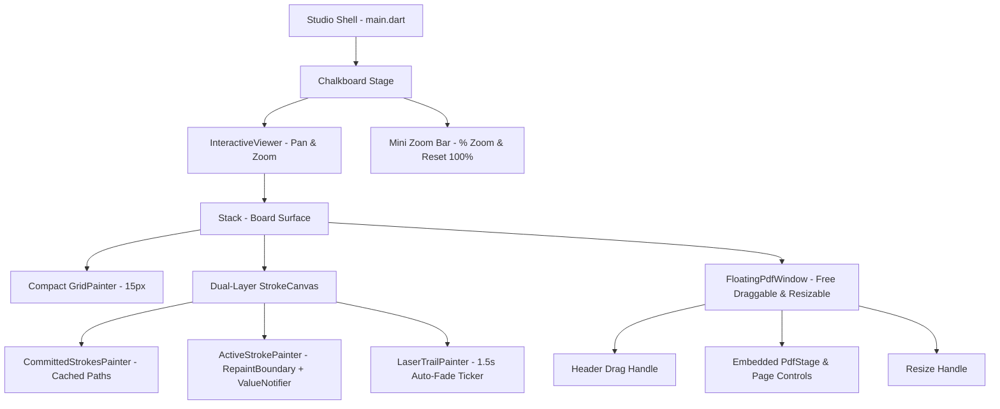

# Plan: Chalkboard Compact Grid, Pan/Zoom, Free-Floating PDF & Zero-Latency Inking

**Mode:** Hard  
**Risk:** normal — multi-file Flutter UI and canvas rendering refactor, testable with unit & widget tests, no auth/data/infra risk  
**Directory:** `plans/chalkboard-zoom-floating-pdf-performance/`  
**Spec:** `plans/chalkboard-zoom-floating-pdf-performance/spec.md`  
**Brainstorm Report:** `plans/reports/261010-chalkboard-zoom-floating-pdf-performance-brainstorm.md`  

---

## Architecture Overview

---

## Phase Breakdown

| Phase ID | Name | Objectives & Covered Stories | Affected Modules |
| :--- | :--- | :--- | :--- |
| `phase-01-dual-layer-inking-grid` | Zero-Latency Dual-Layer Inking & Compact Grid | Thu nhỏ ô ly 15px, tách 2 lớp vẽ committed/active strokes, triệt tiêu lag [P1] | `grid_painter.dart`, `stroke_canvas.dart`, `studio_state.dart` |
| `phase-02-laser-highlighter-pages` | Laser Trail, Highlighter & Multi-Page Undo/Redo | Nét laser tự tan biến sau 1.5s, bút dạ quang trong suốt, chuyển trang và undo/redo chuẩn [P1] | `studio_state.dart`, `stroke_canvas.dart`, `main.dart` |
| `phase-03-pan-zoom-canvas` | Canvas Pan & Zoom with Space Key & Wheel | Giữ Space kéo bảng, lăn chuột zoom 50%-300%, chuẩn hóa tọa độ toScene, mini zoom bar [P1, P2] | `main.dart`, `stroke_canvas.dart`, `studio_state.dart` |
| `phase-04-floating-pdf-window` | Free-Floating Draggable PDF Window & End-to-End | Cửa sổ PDF nổi tự do, kéo thả mọi vị trí, resize góc, tích hợp kéo thả từ khay tài liệu [P1] | `stage_container.dart`, `floating_pdf_window.dart`, `main.dart` |

---

## File Ownership

- `app/lib/widgets/grid_painter.dart`: Phase 01
- `app/lib/widgets/stroke_canvas.dart`: Phase 01, Phase 02, Phase 03
- `app/lib/models/studio_state.dart`: Phase 01, Phase 02, Phase 03, Phase 04
- `app/lib/widgets/floating_pdf_window.dart`: Phase 04
- `app/lib/widgets/stage_container.dart`: Phase 04
- `app/lib/main.dart`: Phase 02, Phase 03, Phase 04
- `app/test/`: Phase 01, Phase 02, Phase 03, Phase 04

---

## Risks & Mitigations

1. **Rủi ro:** Khi zoom bảng, nét vẽ bị lệch so với đầu bút nếu không transform tọa độ.
   - *Biện pháp:* Dùng `TransformationController.toScene(localOffset)` để quy đổi mọi tọa độ chuột/bút về unscaled canvas coordinates trước khi thêm vào stroke.
2. **Rủi ro:** Ticker của Laser Trail chạy ngầm gây hao pin hoặc lag UI khi không dùng laser.
   - *Biện pháp:* Ticker tự động ngắt (`stop()`) ngay khi danh sách điểm laser rỗng.
3. **Rủi ro:** Kéo cửa sổ PDF bị giật do trigger rebuild toàn bảng.
   - *Biện pháp:* Dùng `ValueNotifier<Offset>` cho vị trí cửa sổ nổi để chỉ rebuild card PDF khi kéo.

---

## Session Notes & Verification Results
- **Phase 01:** Compact 15.0px grid, dual-layer inking architecture with cached `BoardStroke.getPath(size)`, separated `CommittedStrokesPainter` and `ActiveStrokePainter` with zero widget rebuilds during drag.
- **Phase 02:** Laser Trail with 1.5s auto-fade ticker, translucent highlighter (`alpha: 0.35`, 20px ribbon), multi-page navigation (`nextPage`, `prevPage`, `addPage`), and accurate per-page undo/redo stacks (`Ctrl+Z`, `Ctrl+Y`).
- **Phase 03:** `InteractiveChalkboard` with Space-key pan detection, mouse wheel zoom (0.5x–3.0x), scene coordinate normalization via `toScene()`, and glassmorphic Mini Zoom Bar (`-`, `% Zoom` tap-to-reset, `+`, Hand Tool).
- **Phase 04:** `FloatingPdfWindow` with top header drag handle, corner resize handle, maximize/restore toggle, embedded `PdfStage` annotations, close button preserving documents in shelf, and drop target positioning.
- **Test Results:** 27 passing tests across the entire test suite (`drawing_engine_test`, `stage_switcher_test`, `pdf_integration_test`, `floating_accessories_test`, `studio_test`).
- **Static Analysis:** `flutter analyze` completed with 0 errors/warnings.

